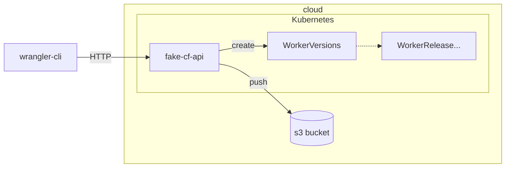

# rust-fake-cf-api

An api who discuss with the [wrangler CLI](https://github.com/cloudflare/workers-sdk) to deploy your workers on a
different platform than cloudflare.

## Run it

> **Note** : you need to configure a S3 Bucket and install all CRD
> defined [here](https://github.com/clementreiffers/CfKubernetesArch).
> you need then to register to AWS, by running `aws configure`.

Once all setup, you can run this API by running:

```terminal
cargo run -- 
    --s3-bucket-name <your-bucket-name> 
    --s3-endpoint <your-bucket-endpoint>
    --s3-region <your-region>
```

## Build it

you can run:

```terminal
cargo build --release
```

Compiling this project takes a lot of time, you can download the last release of this project
[here](https://github.com/clementreiffers/rust-fake-cf-api/releases) (release available for ubuntu, macOS, alpine and
windows)

## Use it

code your [first worker](https://developers.cloudflare.com/workers/examples/) and now you can deploy it, by running:

```terminal
CLOUDFLARE_API_BASE_URL=<your-api-endpoint>/client/v4 wrangler deploy
```

## Architecture


